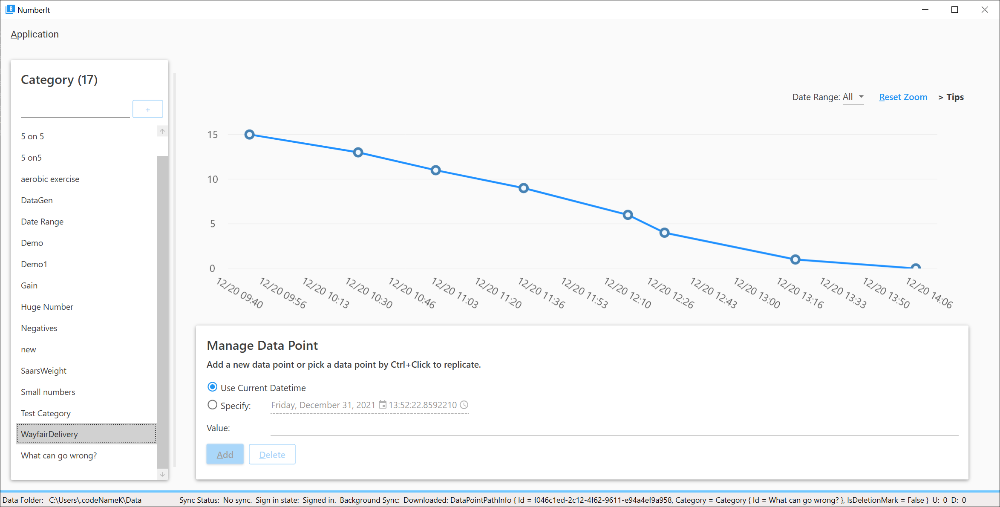

# CodeNameK Readme

## Videos

[CodeNameK on YouTube](https://youtube.com/playlist?list=PLxWo8vu0UTZ28_GwEGdjwExCHDKx1WCua).

## Beta1 for Desktop is coming

After about 3 months, NumberIt (CodeName:K Desktop) is almost ready for releasing.
Please mark the page because More details will be shared here.

* For now, a screenshot:

  Or if you dare, build it from the source :-)

## References

* [Microsoft Graph Gallery](https://developer.microsoft.com/en-us/graph/gallery)
  * [Fork Repo](git@github.com:xiaomi7732/onedrive-sample-apibrowser-dotnet.git)
  * Microsoft.Graph.Auth is deprecated: <https://github.com/microsoftgraph/msgraph-sdk-dotnet-auth>, use Azure.Identity instead.
* [ASP.NET Core WebHooks Sample - Graph notification](https://github.com/microsoftgraph/aspnetcore-webhooks-sample/tree/main/)
