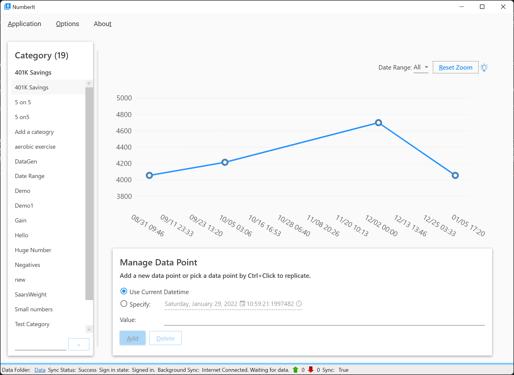

# CodeNameK Readme

## Videos

[CodeNameK on YouTube](https://youtube.com/playlist?list=PLxWo8vu0UTZ28_GwEGdjwExCHDKx1WCua).

## Beta2 for Desktop is released

Refer to the release page here: [Number It 1.0.0-beta2](https://github.com/xiaomi7732/CodeWithSaar/releases/tag/NumbetIt.1.0.0-beta2) for details, or download it now: [NumberIt.1.0.0-beta2.7z](https://github.com/xiaomi7732/CodeWithSaar/releases/download/NumbetIt.1.0.0-beta2/NumberIt.1.0.0-beta2.win10-x64.7z).

* To run the application:
  * Extract the zip file to anywhere on your PC.
  * Run the exe at: public/win10-x64/CodeNameK.WPF.exe

* A screenshot when for the running application:

* File issues at [issues](https://github.com/xiaomi7732/CodeWithSaar/issues).

## References

* [Microsoft Graph Gallery](https://developer.microsoft.com/en-us/graph/gallery)
  * [Fork Repo](git@github.com:xiaomi7732/onedrive-sample-apibrowser-dotnet.git)
  * Microsoft.Graph.Auth is deprecated: <https://github.com/microsoftgraph/msgraph-sdk-dotnet-auth>, use Azure.Identity instead.
* [ASP.NET Core WebHooks Sample - Graph notification](https://github.com/microsoftgraph/aspnetcore-webhooks-sample/tree/main/)
