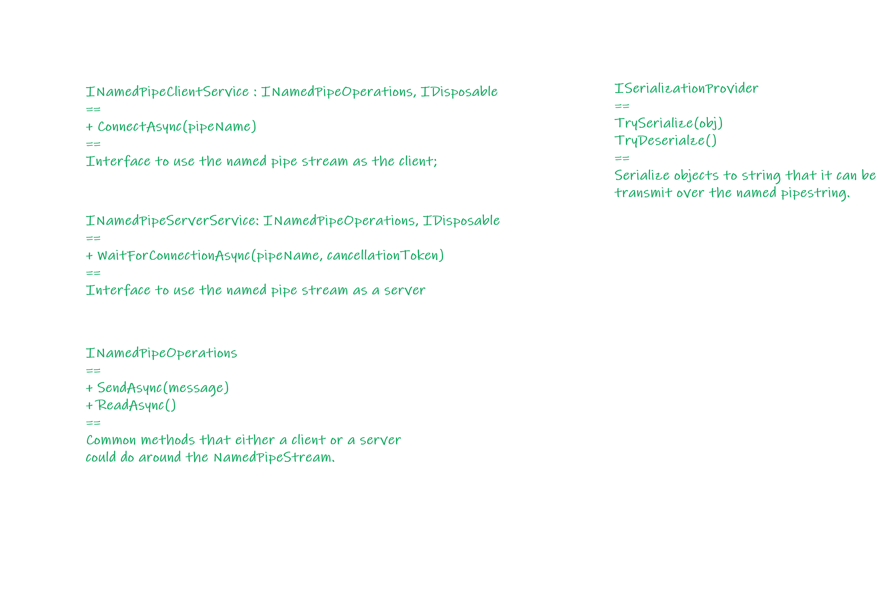

# Two-way named pipe stream wrapper

## Description

This is a simple warper around named-pipe for **local**, **two-way**, **inter-proc** communication.

* **src/DuplexNamedPipeService** contains the implementations.
* **src/Example.Server** spins up a named pipe server;
  * [Program.cs](./examples/Example.Server/Program.cs)
* **src/Example.Client** spins up a named pipe client;
  * [Program.cs](./examples/Example.Client/Program.cs)
There are string transmitting from either side; there are serialized object transfer too.

## To run the example

Start the server in a console:

```shell
dotnet run src/Example.Server
```

The server will start and wait for clients to connect.

Then, in another console, run:

```shell
dotnet run src/Example.Client
```

The client will connect to the server and unlock the flow.

## Goal

* Make two-way inter-process communication (IPC) simple;
  * Allows mimimum configuration and establish a pipe for communication.

* Have a clear, designed architecture to avoid Server-Client confusion;
  * One process will either be a server or a client, won't be both.

## Folder Structure

* [src/DuplexNamedPipeService](./src/DuplexNamedPipeService)
  * Primary service implemenation.

* [examples/Example.Client](./examples/Example.Client)
  * Example for how to use it as a client.

* [examples/Example.Server](./examples/Example.Server)
  * Example for how to use it as a server.

* [examples/DataContracts](./examples/DataContracts)
  * Data object that used in the example for trasmitting.

## Architecture

There are 3 primary interfaces plus 1 helper / extension interface:



They serve different purposes:

* INamedPipeClientService

  * For the client code to use the NamedPipeStream as a client;
  * So that the client code won't call into a server method by accident;

* INamedPipeServerService

  * For the client code to use the NamedPipeStrema as a server;
  * So that the client code won't call into a client method by accident;

* INamedPipeOperations

  * Common operations for both Server and Client;
  * In a two way communication environment, the message trasmit methods should be allowed on both the client side and the server side of the named pipe.

* ISerializationProvider

  * Used to serialize / deserialize object so that they could be transmit over the pipeline.

There are some other helper classes like `NamedPipeOptions` that allows customizaiton of the pipeline.

## Limitation

For the simplicity, EOL is used as separator for messages; Messages with EOL in it requires escaping to work.
