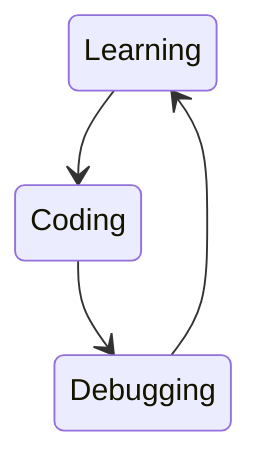

# Welcome to Code with Saar

I build .NET project and I share real world project experience with you to help building code skills to the next level!

This is the primary codebase for my [YouTube channel: Code w/ Saar](https://www.youtube.com/c/CodewithSaar). Here, I share projects, code examples and links to the videos.

## New videos

<!-- BLOG-POST-LIST:START -->
- [How to implement a custom logging provider for files (2/2) CodeNameK - 15](https://youtu.be/3Z3yemyikNc)
- [How to implement a custom logging provider for files (1/2) CodeNameK - 14](https://www.youtube.com/watch?v=3RUpYR4dZM4)
- [Access Android File System by Xamarin CodeNameK - 13](https://www.youtube.com/watch?v=7YJHBX1abfs)
- [IDisposable is IMPORTANT CodeNameK - 12](https://www.youtube.com/watch?v=IjjHp8PWbn4)
- [How to implement User Options with IOptionsMonitor and JsonSerializer CodeNameK - 11](https://www.youtube.com/watch?v=TcHkM5332Ho)
<!-- BLOG-POST-LIST:END -->

To connect with me:

* Twitter [@CodeWithSaar](https://twitter.com/CodeWithSaar).
* Join [the discord server](https://discord.gg/H8ZqDgczQb).
* If you want, [Buy me a coffee](https://www.buymeacoffee.com/codewithsaar).

Keep coding, keep improving:

If you can't seen the chart above, copy and paste it in a <strong>mermaid viewer</strong>.

## Announcements

* 3/2/2022: **Stack Beauty**  is online, check it out: <https://stack.codewithsaar.net>.
* 1/30/2022: **NumberIt** _(CodeNameK)_ 1.0.0-beta2 is released. [Details](./CodeNameK/Readme.md).
* 1/8/2022: **NumberIt** _(CodeNameK)_ 1.0.0-beta1 is released. [Details](./CodeNameK/Readme.md).
* 12/31/2021: **NumberIt** _(CodeNameK)_ release page is established. [Details](./CodeNameK/Readme.md).

## Projects

* Stack Beauty: [GitHub Repo](https://github.com/xiaomi7732/StackBeauty) [Live Site](stack.codewithsaar.net)
* NumberIt - CodeNameK: [Readme](./CodeNameK/Readme.md) / [YouTube Playlist](https://youtube.com/playlist?list=PLxWo8vu0UTZ28_GwEGdjwExCHDKx1WCua)
  * [Introduction](https://youtu.be/7kG__DQlrGE)
* [Two-way named pipe stream wrapper](./IPC/README.md) [NuGet package](https://www.nuget.org/packages/CodeWithSaar.IPC)
* [JWT Auth for AspNetCore WebAPI](./Auth.AspNetCore.WebApi/README.md) [NuGet package](https://www.nuget.org/packages/CodeWithSaar.JWTAuthentication.WebAPI)

## Video Index

### Getting Started

* [How to download .NET](https://youtu.be/O_Un6_2mhL0)
* [How to Build C# Projects](https://youtu.be/yJ-buQg09Qc)
* [C# project](https://youtu.be/uQrs6ioZfzs)
* [Project reference](https://youtu.be/pJETdpS5PR8)

### Fundamentals

* C# Language Features
  * Computed Properties [Doc](./ComputedProperty) [Video](https://youtu.be/lO622PQuPBc)
  * [Extension Method](https://youtu.be/RH4B_i-nq44)
  * [C# Delegate](https://youtu.be/L5SN2-agGaY)

* Important Theories for high quality code

  * [Dispose unmanaged resource correctly by IDisposable](https://youtu.be/IjjHp8PWbn4)
  * [Async avoid is evil](https://youtu.be/Ny8us1qb-E0)
  * [Design code for change](https://youtu.be/XBBlicTQjyg)
  * [Static Methods are BAD](https://youtu.be/qxdVHBO_qxc)
  * [Avoid null - Empty&lt;T&gt;](https://youtu.be/pyKKrO2-daY)
  * [Why async void is evil? How to use it safely when needed?](https://youtu.be/Ny8us1qb-E0)
  * [Bug Study: Async Exception escaped the Exception Handler](https://youtu.be/5p8ZXdVP_Lo)

* Practice the code skills in real projects
  * Feature implementation
    * [Graph APIs: How to Use OAuth 2.0 to Access Microsoft GraphAPI/OneDrive](https://youtu.be/NljQx11YqNY)
    * [Graph APIs: Use Microsoft Graph .NET SDK with Azure.Identity](https://youtu.be/xh0uu4z9-rE)
    * [Graph APIs: Upload large file w/ progress to OneDrive](https://youtu.be/yuoAWP3wn80)
    * Deep Clone with Serializer [Doc](./DeepCloneWithSerializer/README.md) [Video](https://youtu.be/MpM5NIyq18I)
    * [Benchmark: Manual Serialization vs Json Serializer](https://youtu.be/5R3yXyKWk98)

  * Practice system design
    * [How to use C# Channel to implement better syncing experience](https://youtu.be/b9PRGqTKCWQ)
    * [User Options with IOptionsMonitor and JsonSerializer](https://youtu.be/TcHkM5332Ho)
    * [Encoding Filename by Build an Encoder / Decoder](https://youtu.be/-w_b925PSfE)
    * [Two way data synchronization challenge](https://youtu.be/g1wyDi254Yw)
    * [Immutable - an extraordinary strategy for two-way synchronization](https://youtu.be/psYWy6KJTyg)

### Advanced Topics

* Authentication / Authorization - [Playlist](https://www.youtube.com/playlist?list=PLxWo8vu0UTZ2wXMBepa6DUGepJJJoBiUf)
  * [JWT Authentication Overview](https://youtu.be/Ph8ddTRQ0eo)
  * [Role Based Authorization](https://youtu.be/vMJZD3ls7Hc)
  * [Policy Based Authorization](https://youtu.be/NKNIOxcEOso)
  * [End to End Example](https://youtu.be/tLgdbTqQp7Q)
  * [GraphAPI Auth: How to Use OAuth 2.0 to Access Microsoft GraphAPI/OneDrive](https://youtu.be/NljQx11YqNY)

* Logging
  * [.NET (C#) Logging with ILogger](https://youtu.be/gRdi7Z-T9JI)
  * [Benchmark: High performance logging in .NET](https://youtu.be/NDm_VPwaDjI)
  * [How to implement custom logging provider for file](https://youtu.be/3RUpYR4dZM4)
  * [How to support user configuration for a logging provider](https://youtu.be/3Z3yemyikNc)

* [Dependency Injection](./DI)
  * [Learn DI by printing a JSON dog](https://youtu.be/YnBPjt2dBWk)
  * [DI in .NET Core & ASP.NET Core](https://youtu.be/cYV1JmWiTHQ)
  * [Service lifetime in DI container of ASP.NET Core](https://youtu.be/MkORmRZrljo)
  * [Three Anti-Patterns](https://youtu.be/8z1oJSPabLw)
  * [Factory Pattern in DI](https://youtu.be/9Ocjb-NLGhw)

* Configuration / Options for Applications
  * [Options pattern](https://youtu.be/fUSuD84Pr0U)
  * [Option in Depth](https://youtu.be/CnPAhy6M00U)
  * [C# Configuration Providers](https://youtu.be/LbPGciA_NDk)

* [ASP.NET Core Pipeline](https://youtu.be/K9sBI9ZFxRA)

### Mobile / Xamarin

* [Access File System](https://youtu.be/7YJHBX1abfs)
